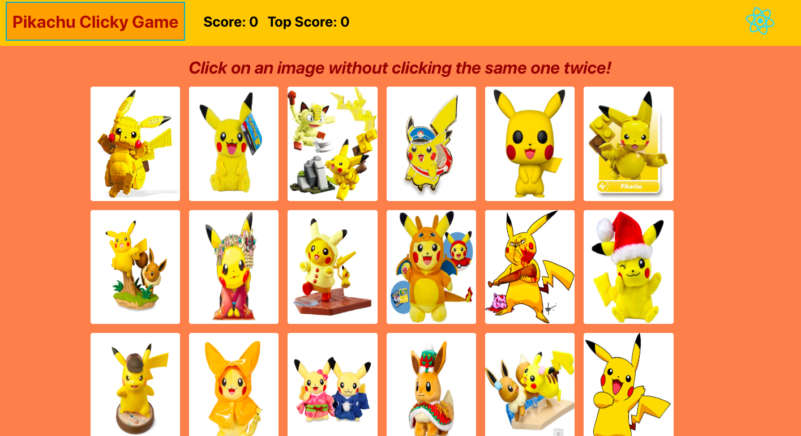
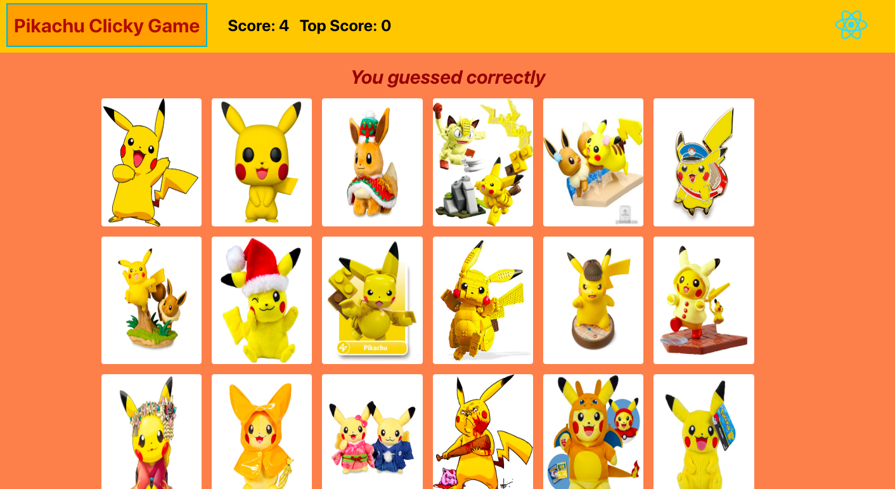
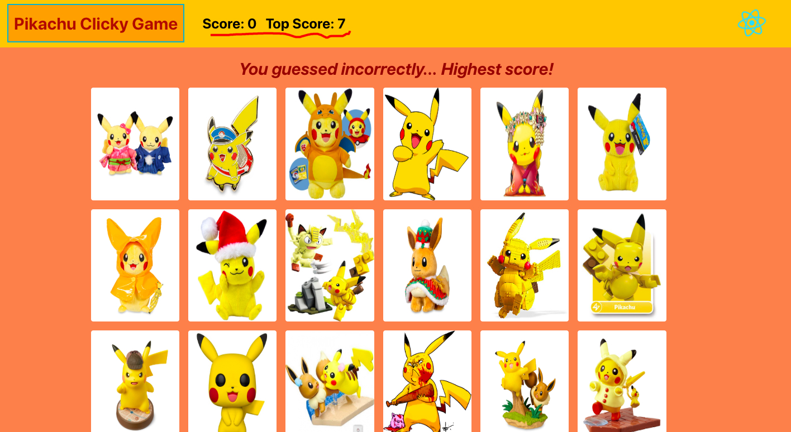

# Clicky Game -- Pikachu Clicky Game

## Overview

* This is a memory game web application using React. 

## Objectives

* Develop a memory game web app using React. 
* Break up application's UI into components, manage component state, and respond to user events.

## Deployment

* go to app @ Heroku:

  * https://secure-basin-15429.herokuapp.com/

* Live app @ GitHub 
  * https://annyhuynh.github.io/Pikachu-Clicky-Game/
 
* GitHub Repository
  * https://github.com/AnnyHuynh/Pikachu-Clicky-Game.git

## Game Rule 

* Click on any of pictures to earn a point, but do not click on the same picure twice.
* Each time when a picture is clicked, positions of the pictures will be shuffled.

### Intallation

* This app can also be installed __locally__ through the following steps 

1. Clone the git repository
    ```
    git clone 
    ```
1. Install necessary packages
    ```
    npm install
    ```
    * This app uses the following NPM packages:
    ```
    "gh-pages": "^2.0.1",
    "react": "^16.8.3",
    "react-dom": "^16.8.3",
    "react-scripts": "2.1.5"
    ```
1. Start the web server
    ```
    npm start
    ```
1. The web page should open in a browser automatically. If it does not, try entering the following URL into the address bar to start devlopment http web server.
    ```
    http://localhost:3000/
    ```

### Directories & Files

* `create-react-app` was used initially to start development of this app, and `App.js` and `App.css` have been modified.
* The other React components such as `ClickyItem`, `AppNavbar` have been added specifically for this web application.

```
src
├── components
│   ├── AppNavbar               -- Navbar React component
│   │   ├── index.js            -- Javascript for AppNavbar
│   │   └── style.css           -- CSS for AppNavbar
│   ├── ClickyItemContainer     -- Clickable items container 
│   │   ├── ClickyItem          -- Single clickable item
│   │   │   ├── index.js        -- Javascript for ClickyItem
│   │   │   └── style.css       -- CSS for ClickyItem
│   │   ├── ItemSrc             -- Image source
│   │   │   └── index.js        -- Data object for the images
│   │   ├── index.js            -- Javascript for ClickyItemContainer
│   │   └── style.css           -- CSS for ClickyItemContainer
│   ├── App.css                 -- css for the App
│   ├── App.js                  -- main game app page
│   └── App.test.js
├── shared
│   └── images
│       └── logo.svg
├── index.css
├── index.js
└── serviceWorker.js

7 directories, 14 files
```

### Game Snapshots

 Initial screen.



 The `Score` increses while same images are not clicked.



 The `Score` resets when the same image is clicked. If it's the highest score, `Top Score` is updated.




